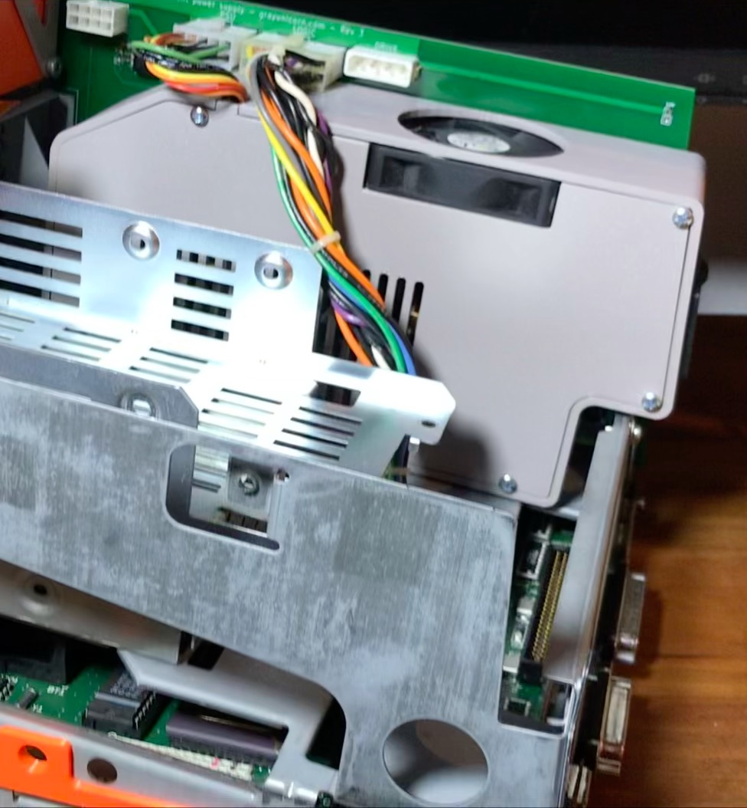

# Analog board replacement, including power supply, for Mac SE or SE/30.

This project does not solve the problem of video. It's here because some people expressed an interest in having it as is. I'm working on a complimentary project that plugs into J2 of this board and will convert video to a LCD display, allowing the Mac to look like nothing is changed... except that the display is mysteriously flat, and very sharp, and it doesn't get hot any more.

The PSU board mounts a Mean Well PT-65B {SU module that supplies most of what the Mac wants. The -5V supply is provided by the 7905 linear regulator. The scematic is extremely simple - a rotary encoder router to header J2, a fan header, and apart from that the PCB is mostly physical support.

The 3D printed parts are designed so that no supports are needed just because I hate removing supports. The space plate is required because the sheet steel of the Mac shassis needs to go up between the PSU and the PCB. Adding this spacer between the printed shroud and the PCB allows this to happen and avoids printing a complex shape where supports would be required. The main piece should be obvious - a fan inserts into it with sides open, that it to use a 60mm fan while retaining the original PSU width. It is held in place with the lid.

With this board in place your Mac will run happily but of course will not show anything, that part is up to you at this point.

The fan may not be required in the final version but because that isn't finished yet I don't know. When it is I can close everything up with a measureing device inside and see what the temperatures in various places get to. If the fan is required I will 3D print a kind of funnel directing the exhaust from the PSU enclosure up and out of the existing case fan hole. If not required I'll just print a blank to go in place of the fan or revise the shroud design to leave the fan out.

I did not find a rotary encoder that was tall enough to just fit. You need to exercise your own ingenuity there, I used a mezzanine PCB and raised the encoder on some pins. The plane that the encoder's pins shoudl lie on is marked on the PCB assuming you use the encoder in the datasheets folder. The encoder can act as a brightness control of sorts varying the light color of the video, or altering the PWM duty cycle of your LCD backlight. 

Unless you are used crimping connectors to make up cables correctly and you can safely wire up power supply modules like this don't do it. This could easily destroy your Mac or kill you with a simple mistake.